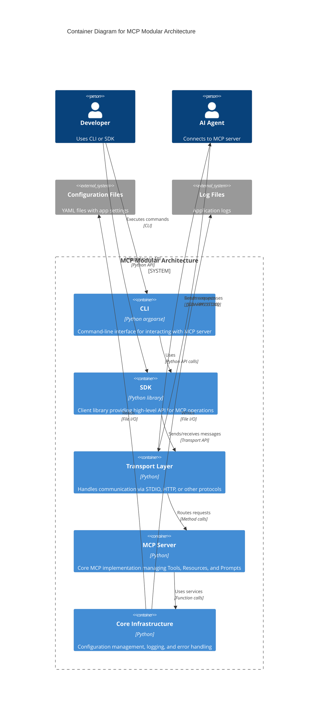

# C4 Container Diagram

## MCP Modular Architecture - Container Level

This diagram shows the high-level containers (applications, services, data stores) that make up the MCP Modular Architecture system and how they interact.



## Diagram Explanation

### Containers

**1. CLI (Command-Line Interface)**
- **Technology**: Python with argparse
- **Purpose**: User-facing command-line tool
- **Responsibilities**:
  - Parse user commands and arguments
  - Format and display results
  - Handle user input validation
  - Delegate operations to SDK
- **Entry Point**: `src/ui/cli.py`

**2. SDK (Software Development Kit)**
- **Technology**: Python library (MCPClient)
- **Purpose**: Client API for MCP operations
- **Responsibilities**:
  - Provide high-level methods for tools, resources, prompts
  - Handle request/response lifecycle
  - Manage connection state
  - Translate errors to client exceptions
- **Entry Point**: `src/sdk/mcp_client.py`

**3. Transport Layer**
- **Technology**: Python with pluggable transport implementations
- **Purpose**: Abstract communication mechanism
- **Responsibilities**:
  - Send/receive messages over STDIO, HTTP, etc.
  - Protocol translation (JSON-RPC style)
  - Route requests to MCP server
  - Return formatted responses
- **Components**:
  - `BaseTransport` (interface)
  - `STDIOTransport` (STDIO implementation)
  - `TransportHandler` (protocol bridge)
- **Entry Point**: `src/transport/`

**4. MCP Server**
- **Technology**: Python
- **Purpose**: Core MCP implementation
- **Responsibilities**:
  - Manage tool, resource, and prompt registries
  - Execute tool operations
  - Serve resource content
  - Generate prompt messages
  - Validate inputs via JSON schemas
- **Components**:
  - `MCPServer` (main server)
  - `ToolRegistry`, `ResourceRegistry`, `PromptRegistry`
  - Tool, Resource, and Prompt implementations
- **Entry Point**: `src/mcp/server.py`

**5. Core Infrastructure**
- **Technology**: Python
- **Purpose**: Foundational services
- **Responsibilities**:
  - Configuration management (YAML)
  - Centralized logging
  - Error handling and custom exceptions
  - Utility functions
- **Components**:
  - `ConfigManager`
  - `Logger`
  - `ErrorHandler`
- **Entry Point**: `src/core/`

### Container Interactions

**Layer Flow (Top-to-Bottom)**:
```
Developer → CLI → SDK → Transport → MCP Server → Core Infrastructure
                                       ↓
AI Agent ────────→ Transport → MCP Server → Core Infrastructure
```

**Key Interaction Patterns**:

1. **CLI → SDK**: CLI exclusively uses SDK, never bypassing to lower layers
2. **SDK → Transport**: SDK formats requests and delegates to transport
3. **Transport → MCP Server**: Transport handler translates protocol to MCP API calls
4. **MCP Server → Core**: MCP uses config, logging, and error handling from core
5. **Transport ↔ AI Agent**: Bi-directional JSON-RPC communication over STDIO

### Dependency Direction

The architecture enforces **unidirectional dependencies**:

```
CLI ─────→ SDK ─────→ Transport ─────→ MCP Server ─────→ Core Infrastructure
```

**Key Principle**: Higher layers depend on lower layers. Lower layers have no knowledge of higher layers.

### External Systems

**Configuration Files**
- YAML files: `config/base.yaml`, `config/development.yaml`, `config/production.yaml`, `config/server.yaml`
- Read by Core Infrastructure's ConfigManager
- Control logging levels, feature flags, and application behavior

**Log Files**
- Written by Core Infrastructure's Logger
- Destination: `logs/app.log`, `logs/server.log`
- Used for debugging, monitoring, and audit trails

### Replaceability

Each container is designed to be replaceable:

- **CLI** → Could be replaced with Web UI, Desktop GUI, or REST API
- **SDK** → Interface remains stable even if implementation changes
- **Transport** → STDIO can be swapped for HTTP, SSE, WebSocket
- **MCP Server** → Tools, resources, prompts are pluggable
- **Core Infrastructure** → Config/logging can be replaced (e.g., with third-party libraries)

### Technology Choices

- **Language**: Python 3.8+ (typing, async support, rich ecosystem)
- **Transport**: STDIO (current), HTTP/SSE (future)
- **Configuration**: YAML (human-readable, comments, validation)
- **Logging**: Python logging module (file rotation, levels, formatting)
- **Testing**: pytest (fixtures, mocking, coverage)

This container diagram shows the internal architecture of the MCP Modular Architecture, illustrating how the five layers work together to implement a clean, maintainable, and extensible MCP server.
