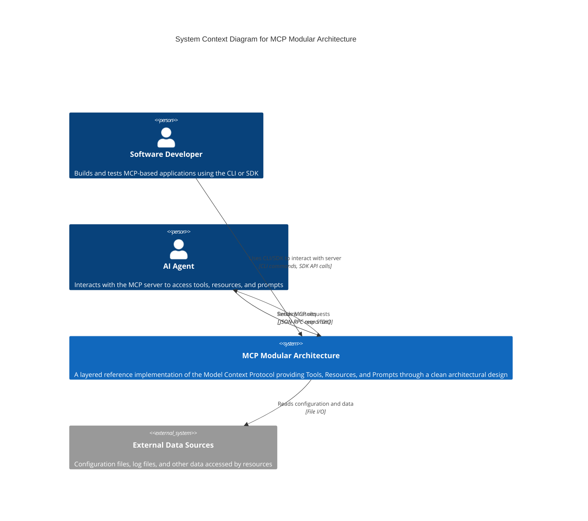

# C4 Context Diagram

## MCP Modular Architecture - System Context

This diagram shows the MCP Modular Architecture system in its environment, including external actors and their interactions with the system.

## Diagram Explanation

### Actors

**Software Developer**
- Primary user of the system
- Interacts via CLI for testing and demonstration
- Uses SDK to build MCP clients
- Purpose: Develop, test, and demonstrate MCP capabilities

**AI Agent**
- External AI system (e.g., Claude, GPT)
- Connects to MCP server via STDIO transport
- Sends JSON-RPC formatted requests
- Purpose: Access tools, read resources, and retrieve prompts

### System

**MCP Modular Architecture**
- Core system implementing Model Context Protocol
- Exposes three MCP primitives: Tools, Resources, Prompts
- Layered architecture with five distinct layers
- Provides both CLI and SDK interfaces for different use cases

### External Systems

**External Data Sources**
- Configuration files (YAML)
- Log files
- Resource data (config, status)
- Purpose: Provide configuration and data to the system

### Key Interactions

1. **Developer → System**: CLI commands or SDK API calls for testing and integration
2. **AI Agent → System**: JSON-RPC requests over STDIO transport
3. **System → AI Agent**: JSON-RPC responses with tool results, resource contents, or prompt messages
4. **System → External Data**: Read configuration files and resource data

### Scope and Boundaries

The MCP Modular Architecture system is a self-contained reference implementation with clear boundaries:
- **Inside scope**: MCP server, tools, resources, prompts, transport layer, SDK, CLI
- **Outside scope**: AI agents, external applications, configuration files

This context diagram establishes the system boundary and shows how external actors interact with the MCP Modular Architecture at the highest level of abstraction.
